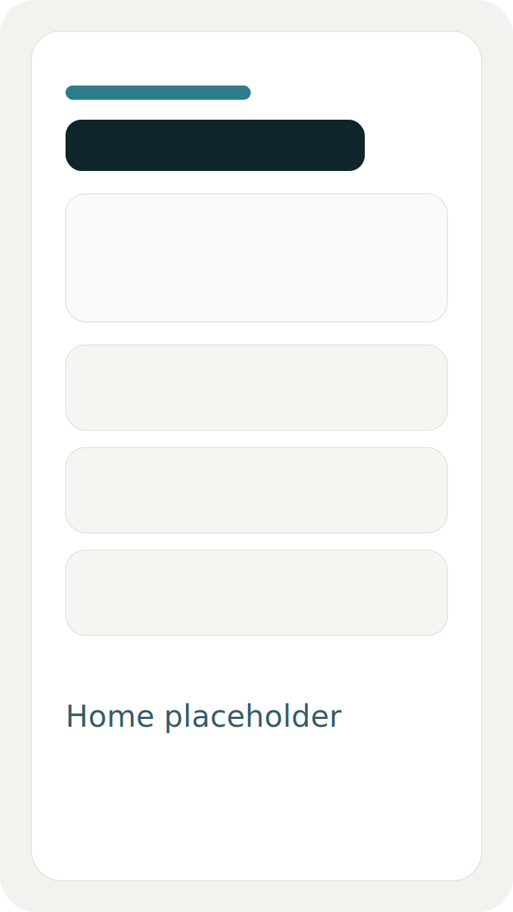
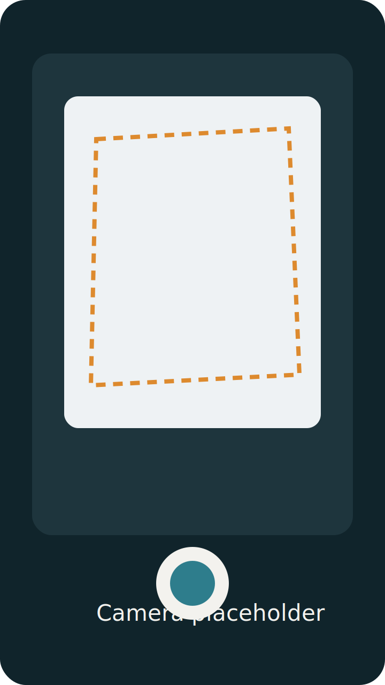
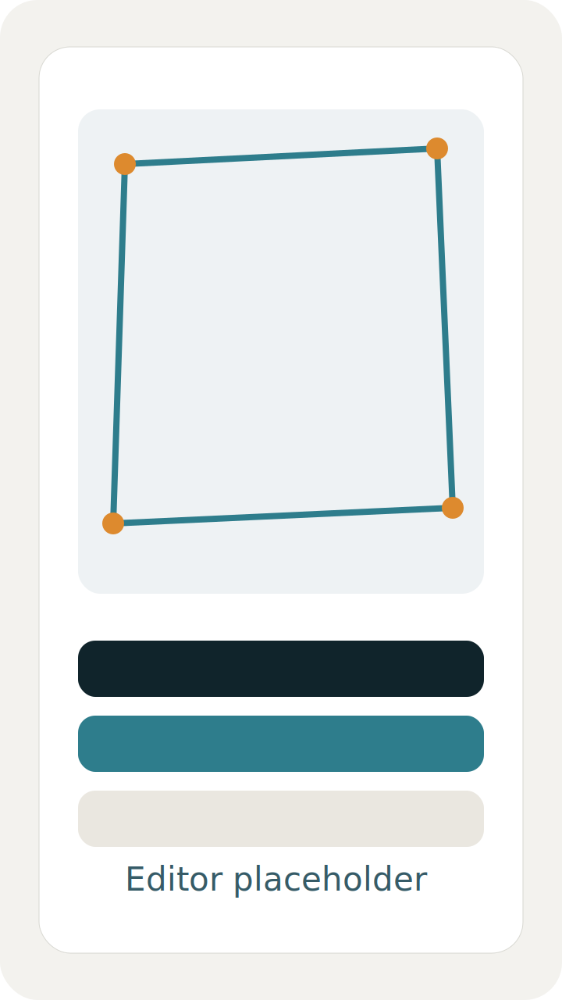
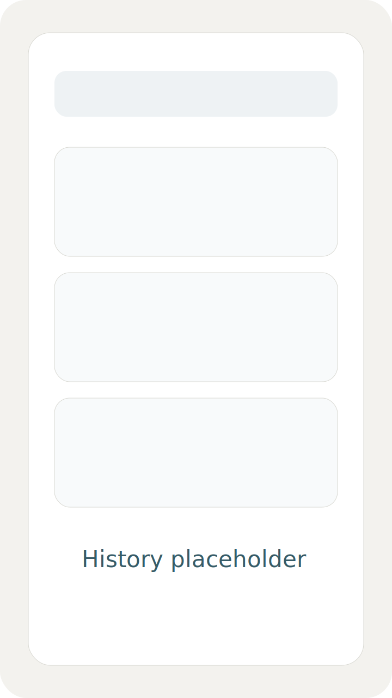

# Scanora

Repositorio: https://github.com/Soturine/scanora
Site: https://soturine.github.io/scanora/
Releases: https://github.com/Soturine/scanora/releases

Scanora é um app Android original de escaneamento de documentos com foco em privacidade, processamento local e uma experiência rápida de captura, revisão e exportação.

## Proposta de valor

- Escanear documentos, recibos e páginas de estudo sem depender de upload obrigatório.
- Corrigir perspectiva, aplicar filtros e organizar lotes localmente.
- Exportar PDF, JPG e PNG com fluxo pensado para MVP evolutivo.
- Executar OCR local para copiar texto reconhecido com poucos toques.

## Destaques do MVP

- Fluxo híbrido com `CameraX` para captura manual e `ML Kit Document Scanner` para scanner guiado.
- OCR com `ML Kit Text Recognition`.
- Organização local com `Room`, busca por título, favoritos e tags.
- Preferências locais com `DataStore`.
- Exportação local com `PdfDocument` e compartilhamento via `FileProvider`.
- Tema claro/escuro e onboarding curto em português do Brasil.

## Screenshots

Placeholders iniciais:

- 
- 
- 
- 

## Stack

- Kotlin
- Android Gradle Plugin 9.1.0
- Gradle 9.3.1 Wrapper
- Jetpack Compose + Material 3
- Navigation Compose
- ViewModel + Coroutines + Flow
- Room
- DataStore
- WorkManager
- CameraX
- ML Kit Document Scanner
- ML Kit Text Recognition

## Arquitetura resumida

Estrutura modular usada no repositório:

- `app`: entrypoint, navegação, onboarding, splash e composição dos módulos.
- `core-common`: modelos, contratos de repositório e use cases centrais.
- `core-data`: Room, DataStore, OCR, exportação e pipeline local de imagem.
- `core-ui`: tema e componentes reutilizáveis de UI.
- `feature-home`, `feature-camera`, `feature-editor`, `feature-export`, `feature-history`, `feature-settings`, `feature-ocr`: telas e ViewModels por contexto funcional.

Mais detalhes em [docs/architecture.md](docs/architecture.md).

## Como rodar

1. Abra o projeto no Android Studio mais recente com suporte a AGP 9.1.
2. Use JDK 17 ou superior compatível com AGP 9 no Gradle.
3. Instale Android SDK Platform 36 e Build Tools 36.0.0.
4. Rode `./gradlew assembleDebug` ou use o botão Run do Android Studio.

Setup detalhado: [docs/setup.md](docs/setup.md)

## Privacidade

- Processamento local por padrão.
- OCR e filtros são executados no dispositivo sempre que possível.
- O scanner guiado do ML Kit depende de componentes do Google Play services no aparelho.
- O app não exige backend nem conta para funcionar no MVP.

Leia a política em [PRIVACY_POLICY.md](PRIVACY_POLICY.md).

## Limitações atuais

- O pipeline local de detecção de documento ainda é heurístico para importações/capturas manuais.
- O scanner guiado depende da disponibilidade do ML Kit no dispositivo.
- Build, lint e testes unitários foram validados localmente em 2026-04-21 com Android SDK Platform 36.
- A revisão visual desta rodada foi estática, via Compose/code review; ainda vale fechar QA em emulador e dispositivos reais.
- Ainda não há sincronização em nuvem, criptografia em repouso ou edição colaborativa.

## Contribuição

Contribuições são bem-vindas. Consulte:

- [CONTRIBUTING.md](CONTRIBUTING.md)
- [CODE_OF_CONDUCT.md](CODE_OF_CONDUCT.md)
- [SECURITY.md](SECURITY.md)

## Roadmap

Resumo curto:

- Curto prazo: melhorar detecção de contornos, UX de crop e qualidade de exportação.
- Médio prazo: lote multi-importação mais robusto, favoritos avançados e mais testes.
- Longo prazo: preparação de release 1.0, hardening de storage e refinamento de OCR.

Versão completa em [ROADMAP.md](ROADMAP.md).

## Status do projeto

`0.1.1` representa um MVP funcional e escalável, já validado em build local e pronto para refinamento técnico e polimento de produção.
